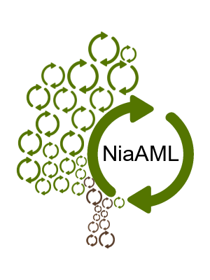
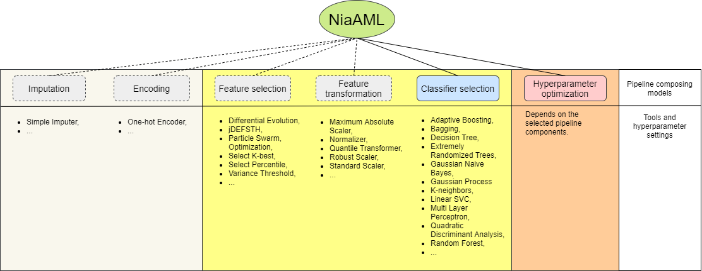

<p align="center"></p>

---

[](https://pypi.python.org/pypi/niaaml)


[](https://pepy.tech/project/niaaml)
[](https://github.com/lukapecnik/niaaml/blob/master/LICENSE)

[](https://coveralls.io/github/lukapecnik/NiaAML?branch=master)
[](https://niaaml.readthedocs.io/en/latest/?badge=latest)


[](http://isitmaintained.com/project/lukapecnik/niaaml "Average time to resolve an issue")
[](http://isitmaintained.com/project/lukapecnik/niaaml "Percentage of issues still open")


[](https://zenodo.org/badge/latestdoi/289322337)
[](https://doi.org/10.21105/joss.02949)

NiaAML is a framework for Automated Machine Learning based on nature-inspired algorithms for optimization. The framework is written fully in Python. The name NiaAML comes from the Automated Machine Learning method of the same name [[1]](#1). Its goal is to compose the best possible classification pipeline for the given task efficiently using components on the input. The components are divided into three groups: feature selection algorithms, feature transformation algorithms and classifiers. The framework uses nature-inspired algorithms for optimization to choose the best set of components for the classification pipeline, and optimize their hyperparameters. We use the <a href="https://github.com/NiaOrg/NiaPy">NiaPy framework</a> for the optimization process, which is a popular Python collection of nature-inspired algorithms. The NiaAML framework is easy to use and customize or expand to suit your needs.

The NiaAML framework allows you not only to run full pipeline optimization, but also to separate implemented components such as classifiers, feature selection algorithms, etc. **It supports numerical and categorical features as well as missing values in datasets.**

* **Free software:** MIT license,
* **Documentation:** https://niaaml.readthedocs.io/en/latest/,
* **Python versions:** 3.6.x, 3.7.x, 3.8.x,
* **Dependencies:** [click](CONTRIBUTING.md#development-dependencies),
* **Tested OS:** Windows, Ubuntu, Fedora, Linux Mint and CentOS. **However, that does not mean it does not work on others.**



## Installation

### pip3

Install NiaAML with pip3:

```sh
pip3 install niaaml
```

In case you would like to try out the latest pre-release version of the framework, install it using:

```sh
pip3 install niaaml --pre
```

### Fedora Linux

To install NiaAML on Fedora, use:

```sh
$ dnf install python-niaaml
```

## Graphical User Interface

There is a simple Graphical User Interface for the NiaAML package available [here](https://github.com/lukapecnik/NiaAML-GUI).

## API

There is a simple API for remote work with NiaAML package available [here](https://github.com/alenrajsp/NiaAML-API).

## Components

[Click here](COMPONENTS.md) for a list of currently implemented components divided into groups: classifiers, feature selection algorithms and feature transformation algorithms. At the end you can also see a list of currently implemented fitness functions for the optimization process, categorical features' encoders, and missing values' imputers. All of the components are passed into the optimization process using their class names. Let's say we want to choose between Adaptive Boosting, Bagging and Multi Layer Perceptron classifiers, Select K Best and Select Percentile feature selection algorithms and Normalizer as the feature transformation algorithm (may not be selected during the optimization process).

```python
PipelineOptimizer(
    data=...,
    classifiers=['AdaBoost', 'Bagging', 'MultiLayerPerceptron'],
    feature_selection_algorithms=['SelectKBest', 'SelectPercentile'],
    feature_transform_algorithms=['Normalizer']
)
```

The argument of the PipelineOptimizer `categorical_features_encoder` is `None` by default. If your dataset contains any categorical features, you need to specify an encoder to use. The same goes for `imputer` and features that contain missing values.

```python
PipelineOptimizer(
    data=...,
    classifiers=['AdaBoost', 'Bagging', 'MultiLayerPerceptron'],
    feature_selection_algorithms=['SelectKBest', 'SelectPercentile'],
    feature_transform_algorithms=['Normalizer'],
    categorical_features_encoder='OneHotEncoder',
    imputer='SimpleImputer'
)
```

For a full example see the [Examples section](#examples) or the list of implemented examples [here](examples).

## Optimization Process And Parameter Tuning

In the modifier version of NiaAML optimization process there are two types of optimization. The goal of the first type is to find an optimal set of components (feature selection algorithm, feature transformation algorithm and classifier). The next step is to find optimal parameters for the selected set of components, and that is the goal of the second type of optimization. Each component has an attribute `_params`, which is a dictionary of parameters and their possible values.

```python
self._params = dict(
    n_estimators = ParameterDefinition(MinMax(min=10, max=111), np.uint),
    algorithm = ParameterDefinition(['SAMME', 'SAMME.R'])
)
```

An individual in the first type of optimization is represented as a real-valued vector that has a size equal to the sum of the number of keys in all three dictionaries (classifier's _params, Feature Transformation algorithm's _params and feature selection algorithm's _params) and the value of each dimension is in the range [0.0, 1.0]. The second type of optimization maps real values from the individual's vector to those parameter definitions in the dictionaries. Each parameter's value can be defined as a range or array of values. In the first case, a value from a vector is mapped from one iterval to another, and in the second case, a value from the vector falls into one of the bins that represent an index of the array that holds possible parameters` values.

Let's say we have a classifier with 3 parameters, a feature selection algorithm with 2 parameters and feature transformation algorithm with 4 parameters. The size of an individual in the second type of optimization is 9. The size of an individual in the first type of optimization is always 3 (1 classifier, 1 feature selection algorithm and 1 feature transformation algorithm).

In some cases we may want to tune a parameter that needs additional information for setting its range of values, so we cannot set the range in the initialization method. In that case, we should set its value in the dictionary to None and define it later in the process. The parameter will be a part of the parameter tuning process as soon as we define its possible values. For example, see [Select K Best Feature Selection](niaaml/preprocessing/feature_selection/select_k_best.py) and its parameter `k`.

**The NiaAML framwork also supports running optimization according to the original method proposed in [[1]](#1) where the components selection and hyperparameter optimization steps are combined into one.**

## Examples

### Example of Usage

Load data and try to find the optimal pipeline for the given components. The example below uses the Particle Swarm Algorithm as the optimization algorithm. You can find a list of all available algorithms in the <a href="https://github.com/NiaOrg/NiaPy">NiaPy's repository</a>.

```python
from niaaml import PipelineOptimizer, Pipeline
from niaaml.data import BasicDataReader
import numpy
import pandas

# dummy random data
data_reader = BasicDataReader(
    x=numpy.random.uniform(low=0.0, high=15.0, size=(50, 3)),
    y=numpy.random.choice(['Class 1', 'Class 2'], size=50)
)

pipeline_optimizer = PipelineOptimizer(
    data=data_reader,
    classifiers=['AdaBoost', 'Bagging', 'MultiLayerPerceptron', 'RandomForest', 'ExtremelyRandomizedTrees', 'LinearSVC'],
    feature_selection_algorithms=['SelectKBest', 'SelectPercentile', 'ParticleSwarmOptimization', 'VarianceThreshold'],
    feature_transform_algorithms=['Normalizer', 'StandardScaler']
)

# run the modified version of optimization
pipeline1 = pipeline_optimizer.run('Accuracy', 15, 15, 300, 300, 'ParticleSwarmAlgorithm', 'ParticleSwarmAlgorithm')

# run the original version
pipeline2 = pipeline_optimizer.run_v1('Accuracy', 15, 400, 'ParticleSwarmAlgorithm')
```

You can save a result of the optimization process as an object to a file for later use.

```python
pipeline1.export('pipeline.ppln')
```

And also load it from a file and use the pipeline.

```python
loaded_pipeline = Pipeline.load('pipeline.ppln')

# some features (can be loaded using DataReader object instances)
x = pandas.DataFrame([[0.35, 0.46, 5.32], [0.16, 0.55, 12.5]])
y = loaded_pipeline.run(x)
```

You can also save a user-friendly representation of a pipeline to a text file.

```python
pipeline1.export_text('pipeline.txt')
```

This is a very simple example with dummy data. It is only intended to give you a basic idea of how to use the framework.

### Example of a Pipeline Component's Implementation

The NiaAML framework is easily expandable, as you can implement components by overriding the base classes' methods. To implement a classifier you should inherit from the [Classifier](niaaml/classifiers/classifier.py) class, and you can do the same with [FeatureSelectionAlgorithm](niaaml/preprocessing/feature_selection/feature_selection_algorithm.py) and [FeatureTransformAlgorithm](niaaml/preprocessing/feature_transform/feature_transform_algorithm.py) classes. All of the mentioned classes inherit from the [PipelineComponent](niaaml/pipeline_component.py) class.

Take a look at the [Classifier](niaaml/classifiers/classifier.py) class and the implementation of the [AdaBoost](niaaml/classifiers/ada_boost.py) classifier that inherits from it.

### Example of a Fitness Function's Implementation

The NiaAML framework also allows you to implement your own fitness function. All you need to do is implement the [FitnessFunction](niaaml/fitness/fitness_function.py) class.

Take a look at the [Accuracy](niaaml/fitness/accuracy.py) implementation.

### Example of a Feature Encoder's Implementation

The NiaAML framework also allows you to implement your own feature encoder. All you need to do is implement the [FeatureEncoder](niaaml/preprocessing/encoding/feature_encoder.py) class.

Take a look at the [OneHotEncoder](niaaml/preprocessing/encoding/one_hot_encoder.py) implementation.

### Example of an Imputer's Implementation

The NiaAML framework also allows you to implement your own imputer. All you need to do is implement the [Imputer](niaaml/preprocessing/imputation/imputer.py) class.

Take a look at the [SimpleImputer](niaaml/preprocessing/imputation/simple_imputer.py) implementation.

### More

You can find more examples [here](examples).

## Contributors ✨

Thanks goes to these wonderful people ([emoji key](https://allcontributors.org/docs/en/emoji-key)):

<!-- ALL-CONTRIBUTORS-LIST:START - Do not remove or modify this section -->
<!-- prettier-ignore-start -->
<!-- markdownlint-disable -->
<table>
  <tr>
    <td align="center"><a href="https://github.com/lukapecnik"><br /><sub><b>Luka Pečnik</b></sub></a><br /><a href="https://github.com/lukapecnik/NiaAML/commits?author=lukapecnik" title="Code">💻</a> <a href="https://github.com/lukapecnik/NiaAML/commits?author=lukapecnik" title="Documentation">📖</a> <a href="https://github.com/lukapecnik/NiaAML/pulls?q=is%3Apr+reviewed-by%3Alukapecnik" title="Reviewed Pull Requests">👀</a> <a href="https://github.com/lukapecnik/NiaAML/issues?q=author%3Alukapecnik" title="Bug reports">🐛</a> <a href="#example-lukapecnik" title="Examples">💡</a> <a href="https://github.com/lukapecnik/NiaAML/commits?author=lukapecnik" title="Tests">⚠️</a> <a href="#infra-lukapecnik" title="Infrastructure (Hosting, Build-Tools, etc)">🚇</a></td>
    <td align="center"><a href="https://github.com/firefly-cpp"><br /><sub><b>firefly-cpp</b></sub></a><br /><a href="https://github.com/lukapecnik/NiaAML/commits?author=firefly-cpp" title="Code">💻</a> <a href="https://github.com/lukapecnik/NiaAML/issues?q=author%3Afirefly-cpp" title="Bug reports">🐛</a> <a href="#mentoring-firefly-cpp" title="Mentoring">🧑‍🏫</a> <a href="#research-firefly-cpp" title="Research">🔬</a> <a href="#ideas-firefly-cpp" title="Ideas, Planning, & Feedback">🤔</a></td>
    <td align="center"><a href="https://github.com/sisco0"><br /><sub><b>sisco0</b></sub></a><br /><a href="#ideas-sisco0" title="Ideas, Planning, & Feedback">🤔</a></td>
    <td align="center"><a href="https://github.com/zStupan"><br /><sub><b>zStupan</b></sub></a><br /><a href="https://github.com/lukapecnik/NiaAML/commits?author=zStupan" title="Code">💻</a></td>
    <td align="center"><a href="https://github.com/musicinmybrain"><br /><sub><b>Ben Beasley</b></sub></a><br /><a href="https://github.com/lukapecnik/NiaAML/commits?author=musicinmybrain" title="Code">💻</a> <a href="#infra-musicinmybrain" title="Infrastructure (Hosting, Build-Tools, etc)">🚇</a></td>
  </tr>
</table>

<!-- markdownlint-restore -->
<!-- prettier-ignore-end -->

<!-- ALL-CONTRIBUTORS-LIST:END -->

This project follows the [all-contributors](https://github.com/all-contributors/all-contributors) specification. Contributions of any kind are welcome!

## Contributing

We encourage you to contribute to NiaAML! Please check out the [Contributing to NiaAML guide](CONTRIBUTING.md) for guidelines about how to proceed.

Everyone interacting in NiaAML's codebases, issue trackers, chat rooms and mailing lists is expected to follow the NiaAML [code of conduct](CODE_OF_CONDUCT.md).

## Support

### Usage Questions

If you have questions about how to use NiaAML, or have an issue that isn’t related to a bug, you can place a question on [StackOverflow](https://stackoverflow.com/).

You can also seek support via [email](mailto:lukapecnik96@gmail.com)

NiaAML is a community supported package, nobody is paid to develop package nor to handle NiaAML support.

**All people answering your questions are doing it with their own time, so please be kind and provide as much information as possible.**

## Issues

Before creating bug reports, please check existing issues list as you might find out that you don't need to create one. When you are creating a bug report, please include as many details as possible in the [issue template](.github/templates/ISSUE_TEMPLATE.md).

## Licence

This package is distributed under the MIT License. This license can be found online at <http://www.opensource.org/licenses/MIT>.

## Disclaimer

This framework is provided as-is, and there are no guarantees that it fits your purposes or that it is bug-free. Use it at your own risk!

## References

<a id="1">[1]</a> Iztok Fister Jr., Milan Zorman, Dušan Fister, Iztok Fister. <a href="https://link.springer.com/chapter/10.1007%2F978-981-15-2133-1_13">Continuous optimizers for automatic design and evaluation of classification pipelines</a>. In: Frontier applications of nature inspired computation. Springer tracts in nature-inspired computing, pp.281-301, 2020.

## Cite us

L. Pečnik, I. Fister Jr. "[NiaAML: AutoML framework based on stochastic population-based nature-inspired algorithms](https://joss.theoj.org/papers/10.21105/joss.02949)." Journal of Open Source Software 6.61 (2021): 2949.

L. Pečnik, Fister, I., Fister, I. Jr. [NiaAML2: An Improved AutoML Using Nature-Inspired Algorithms](https://doi.org/10.1007/978-3-030-78811-7_23). In International Conference on Swarm Intelligence (pp. 243-252). Springer, Cham, 2021.
